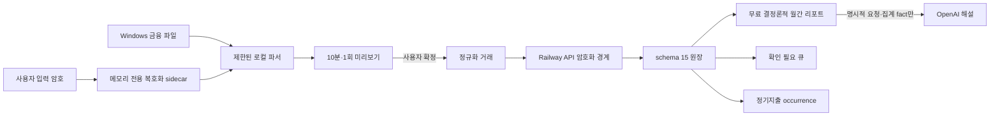

# TM 지출·정기지출 아키텍처 (schema 15)

## 목적과 경계

schema 15는 개인 지출을 읽기 전용으로 수집·정리하고 월간 리포트와 정기지출 납부 일정을 제공한다. 결제, 송금, 계좌 제어, 자동 주문, 원본 금융 파일 보관은 하지 않는다.

- Windows 앱만 KB 신용카드, KB 계좌·체크카드, 카카오페이 XLS/XLSX를 읽는다.
- 원본 파일, 로컬 경로, 파일 암호, 잔액은 Windows 밖으로 보내거나 데이터베이스에 저장하지 않는다.
- 클라우드에는 정규화된 거래만 전송한다. 민감한 문자열은 서버 경계에서 암호화한 뒤 SQLite에 저장한다.
- Windows와 승인된 모바일 기기는 요약, 거래, 확인 큐와 정기지출을 함께 사용한다.
- AI는 사용자가 `AI 해설 생성`을 누를 때 집계 fact만 받아 설명한다. 개별 거래나 상대방 정보는 받지 않는다.

## 데이터 흐름

## 원장 모델

원장은 출처와 import batch, 불변 raw row, posting, economic event, event-posting link, 개인 부담 allocation, review와 rule을 분리한다. 정기지출은 item의 현재 상태와 불변 version, 월별 occurrence를 분리해 과거 월 기록을 보존한다.

금액은 모두 `amountMinor` 정수와 ISO 통화로 저장한다. KRW와 USD는 별도 합계이며 환율 변환은 하지 않는다. 한 posting은 정확히 한 economic event에 속하고, 한 event의 primary posting은 link와 일치해야 한다. migration, startup, backup 검증에서 이 의미 무결성을 확인한다.

확정 순서는 다음과 같이 고정한다.

1. 사용자 명시 연결
2. 동일 거래 중복
3. 취소·환불
4. 카드대금·내 계좌 이동·지갑 충전
5. 교차 출처 mirror
6. 비용 정산
7. 카테고리

순 개인지출은 `구매액 - 환불 - 정산받은 금액 + 다른 사람에게 보낸 비용 정산 + 수수료`로 계산한다. 목적이 불명확한 P2P 송수신은 확인 전 확정 합계에서 제외하고 별도 미확인 외부 유출액으로 표시한다.

## 파일 가져오기

지원 어댑터는 다음 세 개뿐이다.

- `kb_card_usage_v1`
- `kb_account_history_v1`
- `kakaopay_money_v1`

Legacy `.xls` input is inspected as a bounded CFB container before Calamine reads it. The importer rejects VBA/macro storages and sheets, embedded OLE/ActiveX objects, DDE/external workbook records, and malformed BIFF records. `.xlsx` keeps the separate bounded ZIP/relationship inspection.

파일 제한은 20 MiB, 5,000행, 10시트, 100열이다. XLSX ZIP entry와 전체 압축 해제 크기, 압축비, 문자열 길이를 추가 제한한다. 매크로, OLE, ActiveX, 외부 relationship을 거부하고 수식·DDE·외부 링크를 실행하지 않는다.

암호화된 카카오페이 XLSX는 해시가 빌드에 고정된 `tm-office-decryptor.exe`가 처리한다. sidecar 빌드 의존성은 Python 3.12 wheel만 허용하고 모든 직접·전이 패키지를 `requirements-expense-sidecar-lock.txt`의 SHA-256으로 검증한다. 빌드된 실행 파일도 SHA-256을 데스크톱 바이너리에 포함하고 실행 직전에 다시 대조한다. 암호는 stdin으로만 전달하고, sidecar는 숨은 프로세스로 실행되며 30초 제한과 bounded stdout을 적용한다. 평문 임시 파일은 생성하지 않는다. 암호 오류는 재입력 가능한 결과로 반환한다.

미리보기는 서버가 발급한 10분짜리 단일 사용 session ID에 파일 SHA-256과 정규화 SHA-256을 묶는다. commit 시 원본 파일 SHA-256을 다시 확인하고 한 파일을 한 SQLite transaction으로 저장한다. 동일 파일의 정확 replay는 멱등 처리하고 같은 안정 키의 다른 내용은 거부한다.

## 정기지출

정기지출은 월·2개월·3개월·6개월·12개월 주기와 특정일·초일·말일을 지원한다. 존재하지 않는 29~31일과 비윤년 2월 29일은 해당 월 말일로 보정한다. 설정 변경은 지정한 현재 또는 미래 월부터 적용하며 이전 occurrence와 실제 납부는 보존한다.

예정 등록만으로 실제 지출이 되지 않는다. 사용자가 납부 완료를 기록하면 provisional event를 만들고, 이후 실제 거래 연결 시 같은 원자적 작업에서 provisional event를 대체한다. 최초 거래 연결은 항상 확인이 필요하다. `앞으로 자동 연결`을 선택한 경우에만 merchant blind index, 결제수단, 날짜와 금액 조건이 모두 맞는 고신뢰 거래를 이후 자동 연결한다.

## API와 동시성

대량 거래는 `AppSnapshot`에서 제외하고 cursor 기반 전용 API로 조회한다. 모든 지출 응답은 `Cache-Control: no-store`를 사용한다. mutation은 다음을 모두 요구한다.

- `Idempotency-Key`
- route별 정확한 `x-tm-confirm-mutation`
- 생성 시 `If-None-Match: *`
- 수정·삭제·occurrence 처리 시 version을 담은 `If-Match`
- 모바일 session의 same-origin CSRF

파일 preview와 import는 운영 primary administrator만 사용할 수 있다. 모바일 기기는 해당 endpoint와 UI를 사용할 수 없다. incident `read-only`와 `lockdown`에서는 지출 mutation과 AI 호출을 차단한다. 로그에는 고정 route family만 기록하고 거래 ID, 검색값, 업체명, 요청 body는 남기지 않는다.

## 암호화와 키

업체, 상대방, 메모, 정기지출 이름과 업체는 XChaCha20-Poly1305로 암호화한다. 비교가 필요한 값은 HMAC-SHA256 blind index를 별도로 저장한다. 각 암호문에는 record/field 문맥의 AAD를 사용한다.

- Railway: `TM_EXPENSE_DATA_KEY_V1`
- 로컬 Windows: Credential Locker의 `TM Expense Data / v1`
- 운영 복구본: Credential Locker의 `TM Expense Production Data Key`

키는 DB, manifest, Restic backup, JSON/Markdown export에 포함하지 않는다. 키가 없거나 기존 probe와 맞지 않으면 readiness와 지출 API가 fail-closed한다. 운영 키를 분실하면 backup만으로는 지출 문자열을 복구할 수 없다.

## AI 해설

결정론적 요약, 카테고리 합계, 반복 거래 후보는 무료 알고리즘으로 계산한다. AI endpoint는 `gpt-5.4-nano-2026-03-17`, `store:false`, strict Structured Output을 사용한다. 입력은 report status와 집계 fact ID뿐이다. 모델 문장에는 숫자를 허용하지 않고 UI가 원장 fact에서 금액을 렌더링한다.

- 요청 예약 상한: $0.05
- 서울 기준 월 시도: 8회
- 지출 AI 월 hard stop: $1
- 전체 OpenAI 월 hard stop: 기존 $20
- kill switch: `TM_EXPENSE_AI_ENABLED`
- 같은 aggregate SHA-256과 prompt version: 캐시 재사용

일반 AI 오케스트레이터, 메모리, 통합 검색에는 지출 데이터나 AI 지출 report를 자동 노출하지 않는다.

## 백업과 내보내기

모든 schema 15 테이블은 SQLite/Restic backup과 restore manifest에 포함된다. 기본 사용자 JSON/Markdown export는 거래 단위 금융정보를 제외하고 월별 redacted aggregate만 제공한다. manifest hash는 row streaming 방식으로 계산한다.

복원은 불변 import fingerprint, posting, event와 사용자 결정을 merge-forward한다. 동일 키에 다른 내용이 있으면 복원을 중단한다. 이 정책은 오래된 backup을 복원한 뒤 같은 파일을 다시 가져와도 이중 지출이 생기지 않게 한다.
