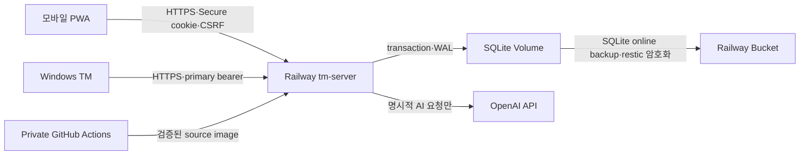

# STEP 16 위협 모델

검토 기준일은 2026-07-22이며 범위는 Windows TM, 모바일 PWA, Railway `tm-server`, SQLite Volume, 암호화 Bucket backup, OpenAI API와 private GitHub build다.

## 보호 자산과 신뢰 경계

| 자산 | 기준 원본 | 주요 보호 목표 |
|---|---|---|
| Task·Note·운동/일정 등 사용자 기록 | Railway Volume의 SQLite | 기밀성·무결성·가용성 |
| primary admin credential | Windows Credential Locker 원문 / Railway SHA-256 | 기기 승인·폐기·운영 API 독점 |
| mobile device credential | Secure HttpOnly cookie 원문 / SQLite SHA-256 | 기기별 최소 권한과 즉시 폐기 |
| OpenAI API key | Railway sealed variable | 서버 밖 비노출·비용 제한·즉시 회전 |
| backup credential/password | Railway sealed variable·사용자 비밀번호 관리자 | backup 암호화·복구 가능성 |
| build source와 산출물 | private GitHub·Actions artifact | 공급망 무결성·secret 비포함 |

브라우저·인터넷·OpenAI 응답·Task/Note의 사용자 문구는 모두 신뢰하지 않는다. Railway process와 Volume도 침해 가능성을 전제로 하며 Bucket backup 암호는 별도 복구 자산으로 취급한다.

## 주요 위협과 통제

| 위협 | 가능한 영향 | 적용 통제 | 잔여 위험·대응 |
|---|---|---|---|
| bearer/device token 탈취 | 전체 또는 기기 scope 접근 | 원문 비저장, 256-bit token, 만료, rate limit, 기기별 폐기, 인증 감사 | primary 노출 시 domain 차단·즉시 회전 |
| CSRF·교차 origin 요청 | 사용자 모르게 mutation | SameSite=Strict, exact HTTPS Origin, CSRF double token+DB hash, no CORS | 브라우저 자체 침해 시 기기 폐기 |
| replay·중복 실행 | 같은 mutation/AI action 반복 | idempotency key, expected version, action 원장, 일회 페어링, POST 자동 재시도 금지 | 결과 불명확 시 GET으로 기준 원본 확인 |
| 권한 우회 | device가 admin/ops/import 실행 | primary/device subject 분리, route allowlist, device scope test | 신규 route 추가 시 scope test 필수 |
| 과대 입력·응답 | 메모리/CPU/비용 고갈 | 2 KiB request target, 16 KiB headers, route별 body, pagination·response 상한, 요청 rate limit | provider L7 DDoS는 Railway 경계에 의존 |
| prompt injection | 데이터 속 명령으로 tool/secret 탈취 | tool 결과 `untrusted`, system instruction 우선, tool allowlist·strict schema·6회 상한, 실행 별도 승인 | 모델 오판 가능성 때문에 자동 mutation 금지 |
| OpenAI 비용 폭주 | 예상치 못한 청구 | 명시적 confirmation, 호출 전 비용 예약, $10 경고, TM $20 hard stop | OpenAI platform budget은 soft limit |
| 악성/취약 dependency·image | build 또는 runtime 침해 | lockfile, SHA-pinned Actions, RustSec, Trivy fs/image, secret scan, private source | 공개 DB 미등재 0-day는 rollback·회전으로 대응 |
| DB/Volume 손상 | 데이터 유실·서비스 중단 | readiness integrity, SQLite online backup, SHA manifest, restic check, RPO 24h | 최대 24시간 데이터 손실 허용 |
| backup에서 폐기 상태 부활 | 분실 기기 재접근·비용 원장 되감기 | append-only 원장 병합, 빈 복구 환경, schema/integrity 검증 | 활성 DB 직접 덮어쓰기 금지 |
| 잘못된 배포 | API 중단·데이터 불일치 | 전체 CI, health gate, singleton, 이전 image rollback 목표 15분 | migration이 비호환이면 별도 복구 환경 사용 |
| Railway/OpenAI 계정 탈취 | 모든 secret·서비스 제어 | MFA, 최소 프로젝트, 임시 SSH key 삭제, audit/runbook | provider 계정 복구 시간은 직접 통제 불가 |

## 사고 모드

- `TM_INCIDENT_MODE=normal`: 정상 서비스와 scheduler 실행
- `TM_INCIDENT_MODE=read-only`: GET/HEAD만 허용하고 mutation·AI·기기 등록을 `503`으로 차단하며 scheduler도 시작하지 않음
- `TM_INCIDENT_MODE=lockdown`: `/healthz`, `/readyz`, primary admin의 인증/운영 상태 외 모든 route를 `503`으로 차단
- `TM_AI_ENABLED=false`: 일반 데이터 기능은 유지하되 OpenAI probe/query와 AI action 승인을 `503`으로 차단

모드는 배포 시 환경변수에서 읽으며 잘못된 값은 server startup을 실패시킨다. 보안보다 가용성을 우선해 자동으로 정상 모드로 돌아가는 동작은 없다.

## 완료 기준

- 위 통제가 unit/integration/production verification에서 재현된다.
- 모든 GitHub Action은 40자리 commit SHA로 고정된다.
- secret·dependency·filesystem·container scan이 high/critical finding에서 CI를 실패시킨다.
- RustSec vulnerability는 실패시키며, 실행 취약점이 아닌 upstream `unmaintained` 경고는 CI 로그에 남겨 별도로 검토한다. 현재 GTK3 경고는 Linux Tauri transitive dependency이고 production server runtime 및 Windows artifact 실행 경로에는 포함되지 않는다.
- Trivy `AVD-DS-0002`는 Railway Volume의 최초 ownership 설정 때문에 2026-10-20까지만 예외로 둔다. entrypoint는 root로 directory를 준비한 직후 server와 backup loop를 모두 uid 10001 `tm`으로 실행하며, static scan이 이 전환과 예외 단일성·만료일을 강제한다.
- production rollback과 Bucket restore drill이 활성 DB를 변경하지 않고 통과한다.
- key/token 회전과 domain 차단 순서가 운영 runbook으로 고정된다.
